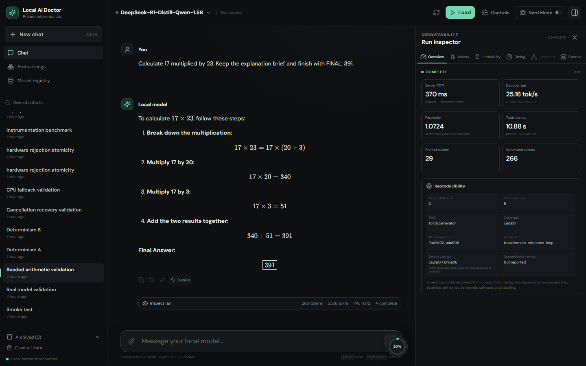
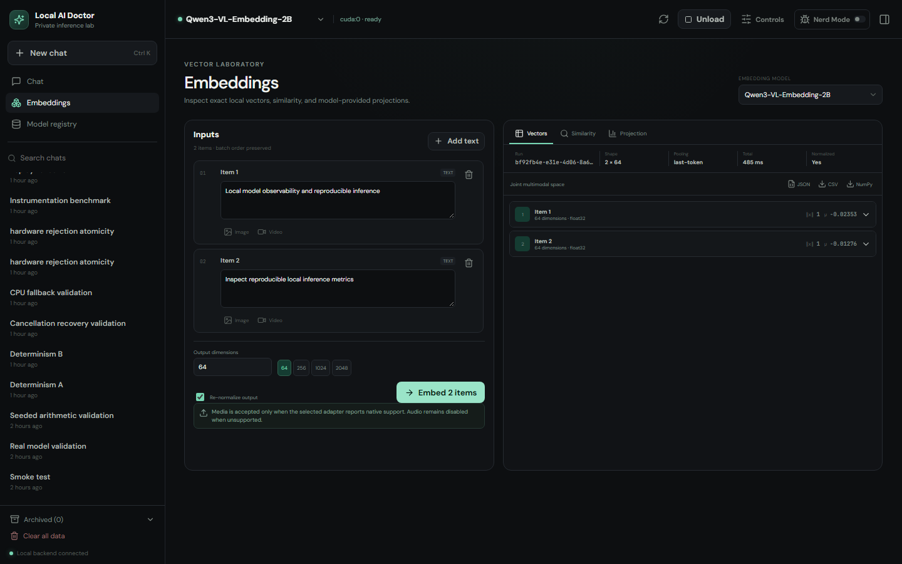
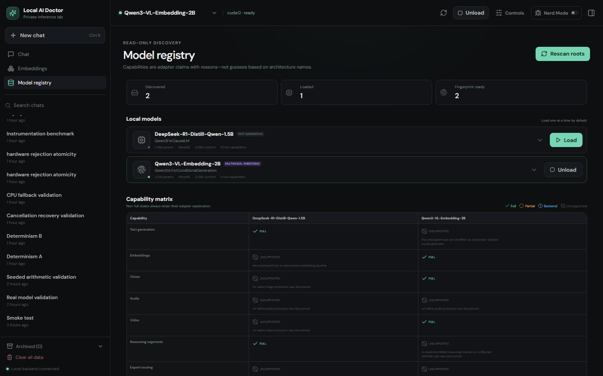
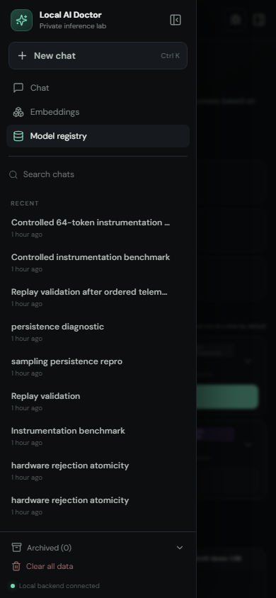

# Local AI Doctor

Local AI Doctor is a local-first inference and observability workbench for SafeTensors model directories. It combines a FastAPI backend, an isolated PyTorch/Transformers worker, SQLite persistence, and a React interface for chat, token-level inspection, model discovery, and multimodal embeddings.

Despite the name, this is a model-diagnostics tool. It is not a medical product and must not be used for diagnosis or clinical decisions.

## What is implemented

- Read-only discovery of configured model roots, SafeTensors header inspection, deterministic fingerprints, component diagnostics, and a machine-readable capability matrix.
- Local causal and generic encoder-decoder generation through explicit reference loops, with cache reuse, cancellation, and replayable WebSocket events. Both paths have deterministic fixture coverage; individual real checkpoints still require validation.
- Tiered token instrumentation: lightweight selected-token/timing fields at `off` and `basic`, and exact raw full-vocabulary likelihood, rank, entropy, perplexity, and bounded alternatives at `token`, `full`, and `expert`.
- Bounded causal self-attention inspection for decoder-only generation at `full` and `expert`: selecting a generated token shows the rendered prompt, conversation history, and earlier generated tokens shaded by their mean post-softmax attention weight. This is an attention-allocation view, not proof of causal influence, grounding, or hallucination.
- Teacher-forced prompt scoring for causal generation models.
- SentenceTransformers text, image, video, and mixed-input embeddings where the selected checkpoint exposes those modalities, with truncation and re-normalization only for reviewed model-specific dimension contracts.
- Persistent chats, runs, partial output, telemetry, attachments, portable chat-workspace import/export, branch-aware run replay, and confirmed terminal-run retention in SQLite and content-addressed storage.
- CPU and CUDA selection, one-model-at-a-time lifecycle management, bounded single-worker admission, a responsive React workbench, and hardened CPU/NVIDIA container definitions.

Support remains capability-gated. Discovery does not imply that every Transformers architecture or modality can run. Unknown or incomplete model folders remain visible with diagnostics instead of being guessed into a working state. See [Known limitations](docs/limitations.md) and the [supplied-model capability report](docs/model-capability-report.md).

## Screenshots

The captures below come from the built application connected to the supplied local checkpoints; they do not use demonstration data.









## Repository map

```text
backend/local_ai_doctor/   API, domain logic, discovery, persistence, workers
frontend/                  React + TypeScript workbench
config/                    portable defaults and local example
docker/                    container preflight, entrypoint, backup utilities
docs/                      architecture, API, metrics, deployment, model notes
scripts/wsl-docker.ps1     WSL2-only Docker command wrapper
tests/                     unit, integration, and security tests
```

## Prerequisites

- Python 3.12 or 3.13. Python 3.12 is the validated development target.
- Node.js 22 or newer and npm for the browser application.
- Enough RAM for the selected checkpoint. CUDA is optional.
- For NVIDIA execution, a compatible NVIDIA driver and a PyTorch CUDA wheel.
- For containers on Windows, WSL2 and a Docker daemon reachable from the selected Linux user.

Model weights are not included and must not be committed to this repository.

## Native Windows quick start

Run these commands from PowerShell in the repository root:

```powershell
py -3.12 -m venv .venv
.\.venv\Scripts\python.exe -m pip install --upgrade pip
.\.venv\Scripts\python.exe -m pip install -r requirements-dev.lock -r requirements-ml.lock
.\.venv\Scripts\python.exe -m pip install --no-deps --editable .
```

For an NVIDIA system, replace the PyTorch wheel selected above with the pinned CUDA build:

```powershell
.\.venv\Scripts\python.exe -m pip install --force-reinstall --no-deps -r requirements-cuda.lock
.\.venv\Scripts\python.exe -c "import torch; print(torch.__version__, torch.cuda.is_available(), torch.cuda.get_device_name(0) if torch.cuda.is_available() else None)"
```

Copy the local configuration example and set your own model root. The resulting file is ignored by Git.

```powershell
Copy-Item config\local.example.yaml config\local.yaml
```

```yaml
schema_version: 1
defaults:
  paths:
    model_roots:
      - X:/path/to/read-only-models
```

Build the frontend once, then start the application:

```powershell
Push-Location frontend
npm ci
npm run build
Pop-Location
.\.venv\Scripts\local-ai-doctor.exe serve --profile native-windows
```

Open [http://127.0.0.1:8000](http://127.0.0.1:8000). The first scan reads metadata and SafeTensors headers but does not load weights. Load a model explicitly from the registry or by starting a supported run.

For a frontend development loop, keep the backend on port 8000 and run `npm run dev` in `frontend/`; Vite serves the UI at [http://127.0.0.1:5173](http://127.0.0.1:5173).

### Installed Windows desktop release

The Electron desktop build starts its packaged backend on `127.0.0.1:6767`,
shows a native startup window immediately, waits for the backend to become
fully ready (database initialized, model-worker startup handshake received, and
registry scan complete), and only then starts and opens the frontend on
`127.0.0.1:6969`. There is no fixed delay; readiness is the only gate.

The release EXE is a persistent per-user installer, not a portable
self-extracting launcher. Run the downloaded EXE once and complete the
installation; use the desktop or Start menu shortcut for every later session.
The one-time installation can take several minutes while Windows extracts and
scans the multi-gigabyte CUDA runtime, but it displays installer progress.
Normal launches reuse those installed files and immediately show a native
startup screen instead of extracting the runtime again. Do not keep opening the
downloaded installer to start the application.

Actual startup timings depend on storage, antivirus scanning, and hardware. A
single-instance lock focuses an existing application window when the installed
shortcut is opened twice. Models remain external and are selected through the
model-directory setting. Configuration, chats, uploads, and cache persist in
Electron's user-data directory.

Every installer bundles the pinned PyTorch 2.8.0 CUDA 12.8 runtime and is named
`Local-AI-Doctor-<version>-cuda.exe`, where `<version>` comes from the root
`VERSION` file. With an NVIDIA driver that supports CUDA 12.8, automatic device
selection uses the GPU; other machines run on CPU and the hardware view says
why. A `runtime.device` set in the desktop user configuration is honored. The
build refuses to produce an installer whose PyTorch is not the requested
variant, whose CUDA DLLs are missing or come from a local CUDA Toolkit, or that
is 1.95 GiB or larger.

Successful `dev` pushes publish beta prereleases and successful `main` pushes
publish stable releases. Each release has one uploaded asset, the CUDA
installer; GitHub's automatic source-code links cannot be removed. See
[desktop/README.md](desktop/README.md) for local build instructions, including
an explicit CPU-only variant. The current executable is unsigned, so Windows
SmartScreen may show a warning.

## Native WSL quick start

Use a Python 3.12 environment inside the selected WSL2 distribution. A Windows model directory is normally visible through `/mnt/<drive>/...`; put that Linux-visible path only in the ignored `config/local.yaml`.

```bash
python3.12 -m venv .venv
. .venv/bin/activate
python -m pip install --upgrade pip
python -m pip install -r requirements-dev.lock -r requirements-ml.lock
python -m pip install --no-deps --editable .
cd frontend && npm ci && npm run build && cd ..
local-ai-doctor serve --profile native-wsl
```

Install a PyTorch wheel appropriate to that WSL environment when using GPU passthrough; do not assume the Windows virtual environment is reusable from Linux.

## Containers through WSL2

Docker operations are intentionally routed through WSL2. Copy `.env.example` to the ignored `.env`
and `config/local.example.yaml` to the ignored `config/local.yaml`, set a Linux-visible `MODEL_PATH`,
then use the wrapper. The Model registry screen can subsequently persist backend-visible model roots
to that local configuration; containers normally use `/models` because the host directory remains a
read-only bind mount.

```powershell
.\scripts\wsl-docker.ps1 -Action Check
.\scripts\wsl-docker.ps1 -Action UpCpu
.\scripts\wsl-docker.ps1 -Action HealthCpu
```

The container ports are permanent and loopback-only: open the frontend at
[http://127.0.0.1:6969](http://127.0.0.1:6969), while the REST API and WebSocket
backend use [http://127.0.0.1:6767/api/v1](http://127.0.0.1:6767/api/v1). Compose
starts serving the UI as soon as the backend readiness response confirms its
database and model worker are ready. No fixed startup delay is used.

`UpCpu` and `UpNvidia` switch profiles automatically, so only one pair can own the fixed ports. `UpNvidia`
proves Docker-level CUDA access before stopping a working CPU profile, then verifies CUDA and both health
endpoints after startup. `NvidiaSmoke` and `HealthNvidia` remain available as standalone diagnostics. The
complete setup, backup, restore, update, and troubleshooting procedures are in [WSL2 container deployment](docs/deployment.md).

## Command line

```powershell
# Start the API and built frontend.
local-ai-doctor serve --profile native-windows

# Scan configured roots without loading model weights.
local-ai-doctor scan --profile native-windows

# Print the effective configuration with secrets and local paths redacted.
local-ai-doctor config --profile native-windows

# Apply a one-run override. Repeat --set as needed.
local-ai-doctor serve --profile native-windows --set runtime.device=cpu --set server.port=8080
```

Configuration also supports `LAD_` environment variables with `__` between nested fields, such as `LAD_RUNTIME__DEVICE=cpu`. See the [configuration reference](docs/configuration.md).

## Using the workbench

1. Inspect the model registry and its diagnostics, context candidates, and capability states.
2. Load only one model at a time. Auto selection prefers the first usable CUDA device and otherwise uses CPU when fallback is permitted.
3. For generation, create or select a chat, set sampling and instrumentation controls, then stream the response. Nerd Mode links visible token boundaries to probability and timing views. A new decoder-only run at `full` or `expert` also lets you select a token and inspect its bounded context-attention map.
4. For an embedding model, open the Embeddings workspace, provide text or supported uploaded media, choose an advertised dimension, and compare normalized vectors.
5. Export a generation run as JSON, replayable JSONL events, or token CSV. The API also exports/imports a path-free chat workspace and can replay a completed generation as a sibling assistant branch using its recorded settings.

The REST API is rooted at `/api/v1`; live runs use the `lad.events.v1` WebSocket subprotocol. See [API and WebSocket reference](docs/api.md) and [metric definitions](docs/metrics.md).

## Verification

Routine tests use small deterministic fixtures and do not require a real model or GPU:

```powershell
.\.venv\Scripts\ruff.exe format --check backend tests
.\.venv\Scripts\ruff.exe check backend tests
.\.venv\Scripts\mypy.exe
.\.venv\Scripts\pytest.exe -m "not real_model and not gpu and not performance"

Push-Location frontend
npm run lint
npm run test:run
npm run build
npx playwright test
Pop-Location
```

The checked-in [CPU CI workflow](.github/workflows/ci.yml) runs the backend checks on Python 3.12 and the frontend lint, unit, build, and Chromium E2E checks on Node.js 22. It excludes tests marked `real_model` or `gpu`; benchmark results are not produced by CI.

The real-model classification test is opt-in and read-only:

```powershell
$env:LAD_REAL_MODEL_ROOT = 'X:\path\to\models'
.\.venv\Scripts\pytest.exe -m real_model tests\integration\test_real_model_classification.py
Remove-Item Env:LAD_REAL_MODEL_ROOT
```

Real inference and performance validation require explicit local hardware and model access. Follow [Benchmarking](docs/benchmarking.md); do not compare results without recording the fingerprint, device, dtype, software, settings, and instrumentation level.

## Documentation

- [Architecture](docs/architecture.md)
- [Adapter development](docs/adapters.md)
- [Configuration reference](docs/configuration.md)
- [API and WebSocket reference](docs/api.md)
- [Metrics and instrumentation](docs/metrics.md)
- [Benchmarking](docs/benchmarking.md)
- [Known limitations](docs/limitations.md)
- [WSL2 container deployment](docs/deployment.md)
- [Supplied-model capability report](docs/model-capability-report.md)
- [Contributing](CONTRIBUTING.md)
- [Security policy](SECURITY.md)

## Privacy and licensing

Normal inference is local and the worker forces Hugging Face and Transformers offline modes. Prompts, outputs, uploads, and telemetry stay in configured local storage; normal logs deliberately exclude them. Exposing the service beyond loopback changes the threat model and requires an authentication token, an explicit opt-in, and a reviewed network boundary.

No license has been selected. Copyright is therefore reserved by default; public distribution and third-party reuse require an explicit license decision by the owner. See [CONTRIBUTING.md](CONTRIBUTING.md) before submitting changes.
